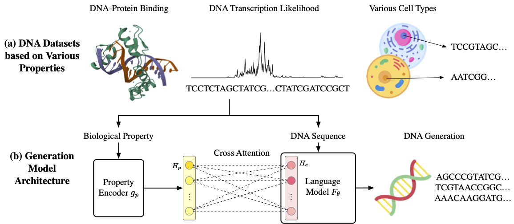

# ATGC-Gen

[//]: # (This is the official implement of Paper [Learning to Discover Regulatory Elements for Gene Expression Prediction]&#40;https://arxiv.org/abs/2502.13991&#41;. You can also find our [paper]&#40;https://huggingface.co/papers/2502.13991&#41; and [material collections]&#40;https://huggingface.co/collections/xingyusu/seq2exp-67daf57c1cfc53d3a4642d44&#41; on <b> 🤗 HuggingFace </b>!)



## Installation

- clone this repo
- create the env and install the requirements
  
```bash
git clone https://github.com/divelab/AIRS.git
cd AIRS/OpenBio/Seq2Exp
source ./install.sh
```

# Dataset

The dataset for this repo can be downloaded from https://huggingface.co/datasets/xingyusu/DNA_Gen. \
Please place the downloaded contents into a newly created folder named `data/`.


# Training and Evaluation

All training and evaluation scripts are located in the `scripts/` directory.

For example, to run the training process of promoter design, execute
```bash
sh scripts/bert_train_promo.sh
```

After training completes, you can perform evaluation with
```bash
sh scripts/bert_gen_promo.sh
```

> **Note:** Please ensure that `ROOT_PATH` and `model_path` are correctly set in the script before running.  
> Other datasets follow similar logic and structure.


# Evaluation by Trained Models

The pretrained models are available at: https://huggingface.co/xingyusu/DNA_ATGC_Gen. \
To use it, set the `model_path` in the corresponding generation script to point to the downloaded `.ckpt` file.


[//]: # (## Citation)

[//]: # ()
[//]: # ()
[//]: # (Please cite our paper if you find our paper useful.)

[//]: # ()
[//]: # (```)

[//]: # (@article{su2025learning,)

[//]: # (  title={Learning to Discover Regulatory Elements for Gene Expression Prediction},)

[//]: # (  author={Su, Xingyu and Yu, Haiyang and Zhi, Degui and Ji, Shuiwang},)

[//]: # (  journal={arXiv preprint arXiv:2502.13991},)

[//]: # (  year={2025})

[//]: # (})

[//]: # (```)

## Acknowledgments

This work was supported in part by National Institutes of Health under grant U01AG070112.