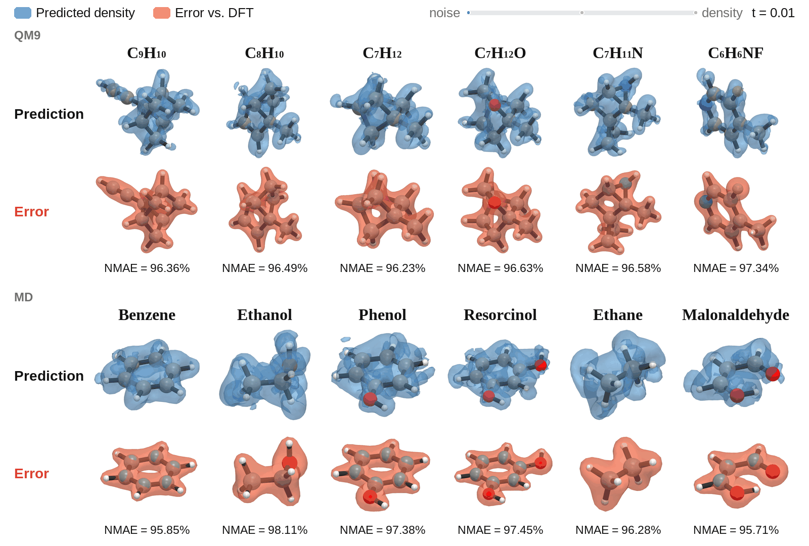

# OrbFlow

**OrbFlow** predicts atomic-orbital expansion coefficients, and from them the electron density, with equivariant flow matching.
This repository contains the code, training and evaluation scripts for the **QM9** and **MD** experiments. Data and model checkpoints are on Hugging Face.

<p align="center">
  
</p>

**Checkpoints:** [huggingface.co/divelab/OrbFlow](https://huggingface.co/divelab/OrbFlow) · **Data:** [huggingface.co/datasets/divelab/OrbFlow-data](https://huggingface.co/datasets/divelab/OrbFlow-data)

| Experiment | Script |
|------------|--------|
| QM9 (main) | [`vision/train_qhf_eqv3_gt_2phase_final.slurm`](vision/train_qhf_eqv3_gt_2phase_final.slurm) |
| MD × 6 molecules | [`vision/train_md_all6_10k100k_k3l3_slim.slurm`](vision/train_md_all6_10k100k_k3l3_slim.slurm) |
| Ablations (10% QM9) | [`docs/ABLATIONS.md`](docs/ABLATIONS.md) |
| MD inference speed | [`efficiency_test/scripts/bench_orbflow_scdp.slurm`](efficiency_test/scripts/bench_orbflow_scdp.slurm) |

More detail: [`docs/TRAINING_QM9.md`](docs/TRAINING_QM9.md) · [`docs/TRAINING_MD.md`](docs/TRAINING_MD.md)

---

## 1. Install

```bash
git clone https://github.com/divelab/AIRS.git
cd AIRS/OpenDFT/OrbFlow

conda create -n orbflow python=3.10 -y
conda activate orbflow
pip install -r requirements.txt
pip install torch-scatter -f https://data.pyg.org/whl/torch-2.4.0+cu124.html
pip install -e .
# wandb login   # if you log online
```

Edit `requirements.txt` if your CUDA build is not 12.4. Default Slurm recipes use **8 GPUs** (QM9) or **4 GPUs** (MD); lower `#SBATCH --gres` and `BATCH_SIZE` if you run out of GPU memory.

---

## 2. Configure

```bash
cp .env.example .env
```

Set:

```bash
PROJECT_ROOT=/absolute/path/to/OrbFlow
DATAPATH=/absolute/path/to/orbflow_data
```

Each Slurm recipe loads `.env` and, when `conda` is on `PATH`, activates the env named by `CONDA_ENV` (default `orbflow`). Submit from the repository root with the env active (`conda activate orbflow && sbatch ...`) so jobs inherit it.

---

## 3. Data

All data is on Hugging Face: [divelab/OrbFlow-data](https://huggingface.co/datasets/divelab/OrbFlow-data) (≈ 1.46 TB in total).
Download it into `DATAPATH`:

```bash
hf download divelab/OrbFlow-data --repo-type dataset --local-dir "$DATAPATH"                    # everything
hf download divelab/OrbFlow-data --repo-type dataset --local-dir "$DATAPATH" --include "MD/*"   # MD only (≈ 25 GB)
```

```text
$DATAPATH/
  datasplits.json                        # QM9 split (same as data_splits/qm9_datasplits.json)
  lmdb/                                  # QM9 geometry + density probes (1.4 TB)
  lmdb_gt_ridge/                         # QM9 target coefficients (β = 1.3)
  MD/scdp_lmdb/<mol>/                    # MD LMDBs
  MD/scdp_lmdb_gt_ridge_beta1.3/<mol>/   # MD target coefficients
  MD/flow_prior_ridge1e6_beta1.3/<mol>/  # MD flow-prior µ/σ
```

MD molecules: `benzene`, `ethanol`, `phenol`, `resorcinol`, `ethane`, `malonaldehyde`.

The QM9 LMDB can also be rebuilt from the public [DTU QM9 tarballs](https://data.dtu.dk/articles/dataset/QM9_Charge_Densities_and_Energies_Calculated_with_VASP/16794500)
with the SCDP pipeline (`vision/preprocess_qm9_lmdb.slurm`), and all target coefficients and MD priors can be recomputed
with the included scripts. See [`docs/DATA.md`](docs/DATA.md).

---

## 4. Checkpoints

Best-validation checkpoints for QM9 (seeds 0 / 42 / 123) and MD (6 molecules × seeds 0 / 42 / 505) are on
[divelab/OrbFlow](https://huggingface.co/divelab/OrbFlow). Download them into the repository root, where the
evaluation scripts expect the run folders:

```bash
hf download divelab/OrbFlow --local-dir . --exclude README.md --exclude .gitattributes
```

They contain model and EMA weights only (no optimizer state): use them for evaluation, not to resume training.
See [`docs/CHECKPOINTS.md`](docs/CHECKPOINTS.md).

---

## 5. Train

**QM9** — 75k endpoint density → 450k integrated density (Euler K = 2); EquiformerV3, 8 layers, ℓmax = 6.

```bash
sbatch vision/train_qhf_eqv3_gt_2phase_final.slurm
sbatch vision/train_qhf_eqv3_gt_2phase_final_s42.slurm
sbatch vision/train_qhf_eqv3_gt_2phase_final_s123.slurm
```

Outputs: `$PROJECT_ROOT/qm9_qhf_eqv3_gt_2ph_final/` (and `_s42` / `_s123`). Re-submit the same script to resume; phase 1 is skipped once it has finished.

**MD** — 10k → 110k; slim EquiformerV3 (96/192/96, 3 layers, ℓmax = 3). Array `0–5` = benzene, ethanol, phenol, resorcinol, ethane, malonaldehyde.

```bash
sbatch vision/train_md_all6_10k100k_k3l3_slim.slurm
sbatch vision/train_md_all6_10k100k_k3l3_slim_seed42.slurm
sbatch vision/train_md_all6_10k100k_k3l3_slim_seed505.slurm   # 2 GPUs, as in the paper

# one molecule
MD_MOLECULE=ethanol sbatch --array=0 vision/train_md_all6_10k100k_k3l3_slim.slurm
```

Outputs: `$PROJECT_ROOT/md_<mol>_k3l3_slim_10k100k/` (and `_seed42` / `_seed505`).

---

## 6. Evaluate

```bash
CKPT_PATH=qm9_qhf_eqv3_gt_2ph_final sbatch vision/test_qhf_eqv3_gt_2ph_final_full.slurm
sbatch vision/test_flow_md_paper_2phase_beta13_all6.slurm
```

OrbFlow evaluation (`scdp/scripts/test_flow.py`) uses a Triton GTO density kernel by default; set `GTO_TRITON_EVAL=0` for the original PyTorch kernel. Training always uses the PyTorch kernel.

Paper numbers use each run's **best-validation checkpoint** (`nmape/val_flow`), with ± over training seeds `{0, 42, 123}` (QM9) and `{0, 42, 505}` (MD).

Expected test nMAPE with the released checkpoints (Euler K = 2): **QM9 0.1518 ± 0.0008%** on the full test set; **MD 0.7975 ± 0.0067%** averaged over the six molecules
(per molecule: [`docs/CHECKPOINTS.md`](docs/CHECKPOINTS.md)).

---

## 7. Ablations

Same architecture on a 10% QM9 subset (15k → 90k). See [`docs/ABLATIONS.md`](docs/ABLATIONS.md).

```bash
python ablation/scripts/make_ablation_split.py   # needs $DATAPATH/datasplits.json
sbatch ablation/scripts/train_curriculum_full.slurm
sbatch ablation/scripts/train_direct_regression.slurm
```

---

## Repository layout

```text
OrbFlow/
├── scdp/                        # Python package
│   ├── model/                   # EquiformerV3 / eSCN backbones, flow-matching module, GTO density (+ Triton kernel)
│   ├── data/                    # LMDB dataset, datamodule, virtual nodes, target-coefficient fitting
│   ├── common/                  # checkpoint helpers and utilities
│   ├── config/                  # Hydra configs: data/, model/, train/
│   └── scripts/                 # entry points: train.py, test_flow.py, test.py,
│                                #   preprocess.py, compute_gt_coeffs_lmdb.py, validate_gt_coeffs.py, bench_flow_infer.py
├── vision/                      # Slurm recipes used for the paper
│   ├── train_*.slurm            #   QM9 and MD training (one script per seed)
│   ├── test_*.slurm             #   QM9 and MD evaluation
│   └── preprocess_* / prepare_* / compute_*.slurm   # data preparation
├── ablation/
│   ├── data/                    # 10% QM9 split
│   └── scripts/                 # ablation training and evaluation
├── efficiency_test/scripts/     # MD inference-speed benchmark (OrbFlow vs SCDP)
├── data_splits/                 # official QM9 train / validation / test split
├── docs/                        # DATA, CHECKPOINTS, TRAINING_QM9, TRAINING_MD, ABLATIONS
├── requirements.txt, setup.py
└── .env.example                 # template for PROJECT_ROOT and DATAPATH
```

---

## Citation & license

OrbFlow builds on the open-source [SCDP](https://github.com/kyonofx/scdp) codebase (Fu et al.).

```bibtex
@inproceedings{fu2024recipe,
  title     = {A Recipe for Charge Density Prediction},
  author    = {Fu, Xiang and Rosen, Andrew and Bystrom, Kyle and Wang, Rui
               and Musaelian, Albert and Kozinsky, Boris and Smidt, Tess
               and Jaakkola, Tommi},
  booktitle = {NeurIPS},
  year      = {2024}
}
```

**License:** MIT — [`LICENSE`](LICENSE).

---

## Acknowledgement

This work was supported in part by the National Science Foundation under Grants IIS-2551110, MOMS-2331036, and CMMI-2226908; the Advanced Research Projects Agency for Health (ARPA-H) under grant 1AY1AX000053; the Texas A\&M University Division of Research Targeted Proposal Teams Funding Program; and the Texas A\&M Institute of Data Science Thematic Labs Program. First-principles calculations by C.W. were primarily supported by the U.S. Department of Energy Office of Basic Energy Sciences under grant DE-SC0023866. We thank Jonas Elsborg and Arghya Bhowmik for their assistance in reproducing the results of the ELECTRA model. We are grateful to Shubham Parashar, Lianhao Zhou, and Wendi Yu for insightful discussions.
