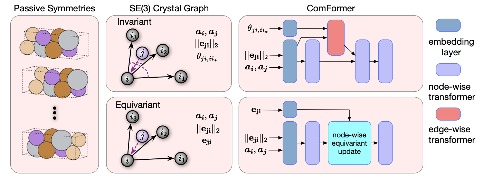
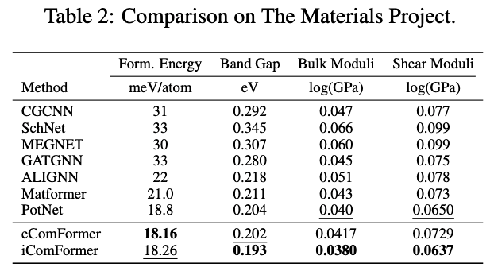
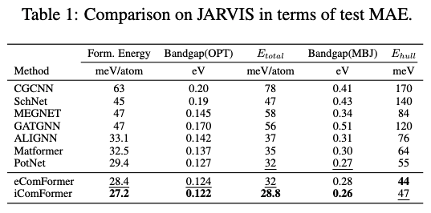
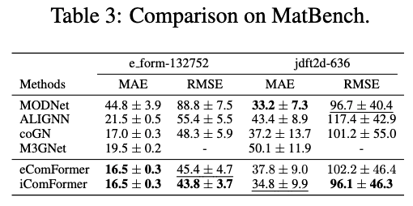
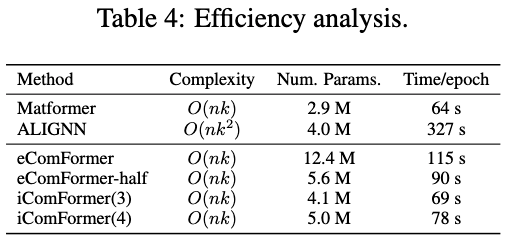

# COMPLETE AND EFFICIENT GRAPH TRANSFORMERS FOR CRYSTAL MATERIAL PROPERTY PREDICTION


[[OpenReview](https://openreview.net/forum?id=BnQY9XiRAS)] [[arXiv](https://arxiv.org/pdf/2403.11857)] [[Code](https://github.com/divelab/AIRS)]

The official implementation of Complete and Efficient Graph Transformers for Crystal Material Property Prediction (ICLR 2024).



## Dataset

### The Materials Project Dataset

For tasks in The Materials Project, we follow Matformer (Yan et al.) and use the same training, validation, and test sets.

### JARVIS dataset

JARVIS is a newly released database proposed by Choudhary et al.. For JARVIS dataset, we follow ALIGNN and use the same training, validation, and test set. We evaluate our ComFormer on five important crystal property tasks, including formation energy, bandgap(OPT), bandgap(MBJ), total energy, and Ehull. The training, validation, and test set contains 44578, 5572, and 5572 crystals for tasks of formation energy, total energy, and bandgap(OPT). The numbers are 44296, 5537, 5537 for Ehull, and 14537, 1817, 1817 for bandgap(MBJ). The used metric is test MAE. 

### Matbench

To further evaluate the performances, we use e_form with 132752 crystals and jdft2d with only 636 2D crystals in MatBench.

## Benchmarked results

### The Materials Project Dataset

### JARVIS dataset

### Matbench


## Enviroment

```bash
conda create --name comformer python=3.10
conda activate comformer
conda install pytorch torchvision torchaudio pytorch-cuda=11.6 -c pytorch -c nvidia # or higher version if you want
conda install pyg -c pyg
pip install jarvis-tools==2022.9.16
python setup.py
```

## Training

```bash
cd comformer/scripts
python train_jarvis.py # for jarvis
python train_mp.py # for the materials project
```

## Efficiency


## Citation
Please cite our paper if you find the code helpful or if you want to use the benchmark results. Thank you!
```
@inproceedings{yan2024complete,
  title={Complete and Efficient Graph Transformers for Crystal Material Property Prediction},
  author={Yan, Keqiang and Fu, Cong and Qian, Xiaofeng and Qian, Xiaoning and Ji, Shuiwang},
  booktitle={International Conference on Learning Representations},
  year={2024}
}
```

## Acknowledgement

We thank Youzhi Luo, Limei Wang, and Haiyang Yu for insightful discussions, and thank Chengkai Liu for drawing 3D visualizations of crystal structures. S.J. acknowledges the support from National Science Foundation grants IIS-2243850 and CNS-2328395. X.F.Q. acknowledges the support from the Center for Reconfigurable Electronic Materials Inspired by Nonlinear Dynamics (reMIND), an Energy Frontier Research Center funded by the U.S. Department of Energy, Basic Energy Sciences, under Award Number DE-SC0023353. X.N.Q. acknowledges the support from National Science Foundation grants CCF-1553281, DMR-2119103, and IIS-2212419. 

Implementation based on Matformer (Yan et al.) which borrowed ideas from ALIGNN.

## Contact

If you have any question, please contact me at keqiangyan@tamu.edu.