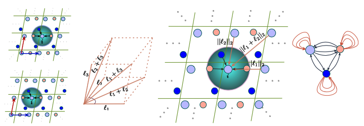
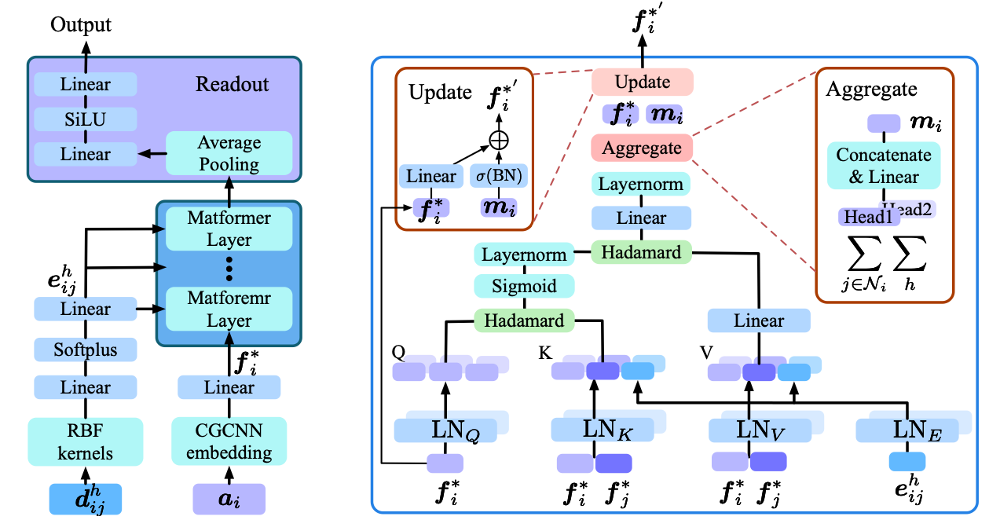
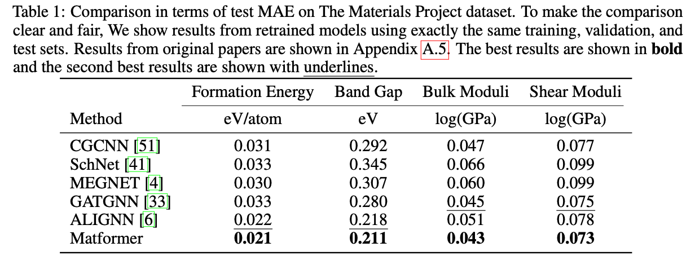
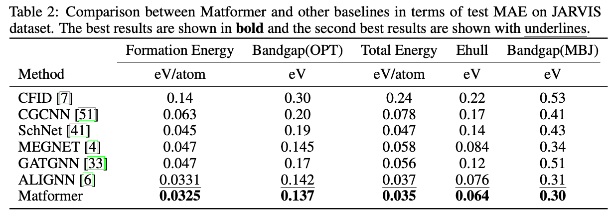
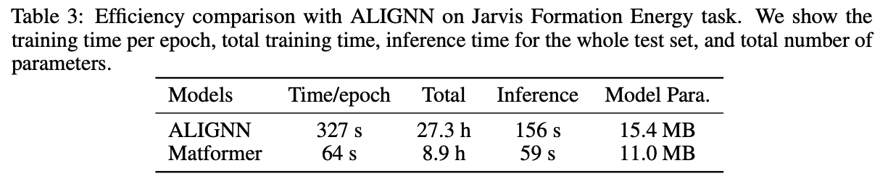

# Periodic Graph Transformers for Crystal Material Property Prediction

<!-- [](https://github.com/MinkaiXu/GeoDiff/blob/main/LICENSE) -->

[[OpenReview](https://openreview.net/forum?id=pqCT3L-BU9T)] [[arXiv](https://arxiv.org/abs/2209.11807)] [[Code](https://github.com/YKQ98/Matformer)]

The official implementation of Periodic Graph Transformers for Crystal Material Property Prediction (NeurIPS 2022).




## Dataset

### The Materials Project Dataset
We provide benchmark results for previous works, including CGCNN, SchNet, MEGNET, GATGNN, ALIGNN on The Materials Project Dataset.

In particular, for tasks of formation energy and band gap, we directly follow ALIGNN and use the same training, validation, and test set, including 60000, 5000, and 4239 crystals, respectively. For tasks of Bulk Moduli and Shear Moduli, we follow GATGNN, the recent state-of-the-art method for these two tasks, and use the same training, validation, and test sets, including 4664, 393, and 393 crystals. In Shear Moduli, one validation sample is removed because of the negative GPa value. We either directly use the publicly available codes from the authors, or re-implement models based on their official codes and configurations to produce the results.

### JARVIS dataset
We also provide benchmark results for previous works, including CGCNN, SchNet, MEGNET, GATGNN, ALIGNN on JARVIS Dataset.

JARVIS is a newly released database proposed by Choudhary et al.. For JARVIS dataset, we follow ALIGNN and use the same training, validation, and test set. We evaluate our Matformer on five important crystal property tasks, including formation energy, bandgap(OPT), bandgap(MBJ), total energy, and Ehull. The training, validation, and test set contains 44578, 5572, and 5572 crystals for tasks of formation energy, total energy, and bandgap(OPT). The numbers are 44296, 5537, 5537 for Ehull, and 14537, 1817, 1817 for bandgap(MBJ). The used metric is test MAE. The results for CGCNN and CFID are taken from ALIGNN, other baseline results are obtained by retrained models. 


## Benchmarked results

### The Materials Project Dataset

### JARVIS dataset

## Training and Prediction

You can train and test the model with the following commands:

```bash
conda create --name matformer python=3.10
conda activate matformer
conda install pytorch torchvision torchaudio pytorch-cuda=11.6 -c pytorch -c nvidia
conda install pyg -c pyg
pip install jarvis-tools==2022.9.16
python setup.py
# Training Matformer for the Materials Project
cd matformer/scripts/mp
python train.py
# Training Matformer for JARVIS
cd matformer/scripts/jarvis
python train.py
```

## Efficiency


## Citation
Please cite our paper if you find the code helpful or if you want to use the benchmark results of the Materials Project and JARVIS. Thank you!
```
@article{yan2022periodic,
  title={Periodic Graph Transformers for Crystal Material Property Prediction},
  author={Yan, Keqiang and Liu, Yi and Lin, Yuchao and Ji, Shuiwang},
  journal={arXiv preprint arXiv:2209.11807},
  year={2022}
}
```

## Acknowledgement

This repo is built upon the previous work ALIGNN's [[codebase]](https://github.com/usnistgov/alignn). Thank you very much for the excellent codebase. 

This work was supported in part by National Science Foundation grant IIS-2006861.

## Contact

If you have any question, please contact me at keqiangyan@tamu.edu.
