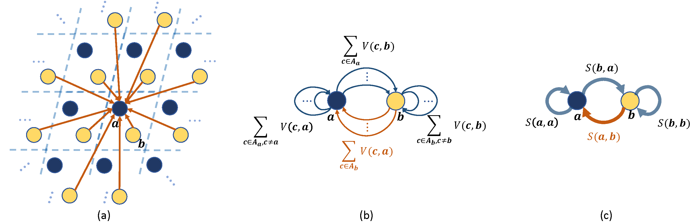

# PotNet
Official code repository of paper “[Efficient Approximations of Complete Interatomic Potentials for Crystal Property Prediction](https://arxiv.org/abs/2306.10045)” by Yuchao Lin, Keqiang Yan, Youzhi Luo, Yi Liu, Xiaoning Qian, and Shuiwang Ji. [[ICML 2023 Poster](https://proceedings.mlr.press/v202/lin23m.html)]



A short mathematical sum-up can be seen [here](Mathematics%20Short%20Sum%20Up.pdf)

## Environment Setup

- We'll use `conda` to install dependencies and set up the environment. We recommend using the [Python 3.9 Miniconda installer](https://docs.conda.io/en/latest/miniconda.html#linux-installers).
- After installing `conda`, run

```shell
conda env create -f environment.yml
```

- Then run below code to activate the environment

```
conda activate potnet
```

- We are using `torch-geometric` for the implementation of our graph neural networks. Installation of `torch-geometric` via conda seems problematic so we install it explicitly using pip as

```shell
pip install torch-scatter==2.1.0 torch-sparse==0.6.16 torch-cluster==1.6.0 torch-spline-conv==1.2.1 -f https://data.pyg.org/whl/torch-1.12.1%2Bcu116.html
```

and

```shell
pip install torch-geometric
```

- Be aware that we are using an old version of JARVIS toolkits `jarvis-tools==2022.9.16`. The newest JARVIS toolkits will contain new versions of datasets that include more data than the one we present in the paper.

## Running Summation Algorithm

- To run the summation algorithm, please run below commands in order to install the algorithm package (remember to replace the `TARGET_PATH` with your own destination.)

```shell
cd functions
tar xzvf gsl-latest.tar.gz
cd gsl-2.7.1
./configure --prefix=TARGET_PATH
make
make install
```

- Then edit `~/.bashrc` by adding

```bash
export LD_LIBRARY_PATH=$LD_LIBRARY_PATH:TARGET_PATH/lib/
```

and 

```shell
source ~/.bashrc
```

or create another terminal.

- Now we back to `functions` directory and run

```shell
python setup.py build_ext --inplace
```

- Then the algorithm is installed as Cython package. A simple way to test if it is successfully installed is to run below in the root directory.

```shell
python test_algorithm.py
```

## Using Summation Algorithm

In this code base, we provide six infinite summations of

- Coulomb potential
- London dispersion potential
- Pauli repulsion potential
- Lennard-Jones potential
- Morse potential
- Screened Coulomb potential

and they are achieved in `algorithm.py` by

- `epstein` referring to summation $\sum_{\mathbf{k}\in \mathbb{Z}^d, \Vert \mathbf{L}\mathbf{k}+\mathbf{v} \Vert\ne 0}\frac{e^{2\pi i \mathbf{w} \cdot \mathbf{L} \mathbf{k}}}{\Vert \mathbf{L}\mathbf{k}+\mathbf{v} \Vert^{2p}}$
- `zeta` referring to summation $\sum_{\mathbf{k}\in \mathbb{Z}^d, \Vert \mathbf{L}\mathbf{k}+\mathbf{v} \Vert\ne 0}\frac{1}{\Vert \mathbf{L}\mathbf{k}+\mathbf{v} \Vert^{2p}}$
- `exp` referring to summation $\sum_{\mathbf{k}\in \mathbb{Z}^d } e^{-\alpha \Vert \mathbf{L}\mathbf{k}+\mathbf{v} \Vert}$
- `lj` referring to summation $\sum_{\mathbf{k}\in \mathbb{Z}^d, \Vert \mathbf{L}\mathbf{k}+\mathbf{v} \Vert\ne 0}(\frac{\sigma^{12}}{\Vert \mathbf{L}\mathbf{k}+\mathbf{v} \Vert^{12}} - \frac{\sigma^6}{\Vert \mathbf{L}\mathbf{k}+\mathbf{v} \Vert^6} )$
- `morse` referring to summation $\sum_{\mathbf{k}\in \mathbb{Z}^d} (e^{-2\alpha (\Vert \mathbf{L}\mathbf{k}+\mathbf{v} \Vert - r_e) } - 2e^{-\alpha (\Vert \mathbf{L}\mathbf{k}+\mathbf{v} \Vert - r_e)})$
- `screened_coulomb` referring to summation $\sum_{\mathbf{k}\in\mathbb{Z}^d, \Vert \mathbf{L}\mathbf{k}+\mathbf{v} \Vert\ne 0} \frac{e^{-\alpha \Vert \mathbf{L}\mathbf{k}+\mathbf{v} \Vert}}{\Vert \mathbf{L}\mathbf{k}+\mathbf{v} \Vert} $

Each function requires the input of vectors `v` and a lattice matrix `Omega`, alongside a particular `param` and dimension `d`. We've also incorporated parameter `R`, which denotes half of the grid's length, and `verbose` which, when enabled, conducts corresponding error bound calculations.

For executing a single computation in parallel, set the `parallel` parameter to `True`. By default, the program will use `NUM_CPUS` (set to 32) for concurrent computation. However, keep in mind that during data processing within our model, this setting is overridden to `False`. This is due to the fact that we've applied a more efficient parallelization method via `pandarallel`.

The summation is computed over the grid instead of the ellipsoid, as we found this is much more efficient for computing summations of multiple vectors by numpy vectorization. Also, currently, we have implemented the error bound computation for `epstein`, `zeta`, and `exp` which are used in our model. For details of error bound computation, please refer to Appendix C.5 in our paper.


## Train and Evaluate Models

In this code base, the datasets are directly provided by JARVIS toolkits and there is no need to download the JARVIS or Materials Project dataset from the official site. To change between different datasets and among different properties, go to `potnet.yaml` and set the corresponding entries such as

```yaml
dataset: dft_3d
# JARVIS dataset: dft_3d
# MP dataset: megnet
target: formation_energy_peratom
# JARVIS dataset entries: formation_energy_peratom, mbj_bandgap, optb88vdw_bandgap, optb88vdw_total_energy, ehull
# MP dataset entries: e_form, gap pbe
```

To train our model, use the script

```shell
python main.py --config configs/potnet.yaml --output_dir xxx --checkpoint xxx
```

Here, `output_dir` denotes the output directory of checkpoints and processed data files, and `checkpoint` denotes the path of a checkpoint meaning restarting training from a certain checkpoint. One can also omit `checkpoint` in this script. Note that after training, the code will conduct the evaluation for **the last epoch**. It is recommended to do an evaluation below by specifying a checkpoint from the best 5 saved in the `checkpoint` directory.

To evaluate our model, use the script

```shell
python main.py --config configs/potnet.yaml --output_dir xxx --checkpoint xxx --testing
```

and here `checkpoint` denotes the path of a checkpoint and `testing` denotes enabling the evaluation phase.

## Train on Custom Dataset

We are supporting custom datasets in the same format as datasets in [JARVIS Leaderboard](https://github.com/usnistgov/jarvis_leaderboard/tree/main) [4]. Once the corresponding dataset is prepared, use the script

```shell
python main.py --config configs/potnet.yaml --output_dir xxx --checkpoint xxx --data_root xxx
```

and change the target name as `target` in `potnet.yaml` such like

```yaml
dataset: dft_3d
target: target
```

And here `data_root` denotes the path of the custom dataset, where dataset information `dataset_info.json` and targets `id_prop.csv` are included. Then our code will read the dataset information from `dataset_info.json` and `id_prop.csv` in the dataset directory and then read the data from `data_root`. Note that a dataset in the JARVIS Leaderboard can be generated by [`jarvis_populate_data.py`](https://github.com/usnistgov/jarvis_leaderboard/blob/main/jarvis_leaderboard/jarvis_populate_data.py). To generate the same dataset format based on [`jarvis_populate_data.py`](https://github.com/usnistgov/jarvis_leaderboard/blob/main/jarvis_leaderboard/jarvis_populate_data.py) to accommodate our code, it is recommended to

- Generate the crystal structures that can be read by JARVIS toolkits and their corresponding properties to predict
- Predefine the train-val-test split of your dataset and write the crystal ids and targets in order in `id_prop.csv`

## Pretrained Models

We provide preprocessed files and pretrained models in this [google drive](https://drive.google.com/drive/folders/1sKZZ_MffSPNx4fy5FJLgeCj0nhrxzf5f?usp=sharing). Right now we only provide the checkpoint for formation energy per atom of the JARVIS dataset. Please stay tuned for more pretrained models! To use these files, specify `--output_dir` such like

```shell
python main.py --config configs/potnet.yaml --output_dir formation_energy_peratom --checkpoint xxx
```

then the processed file will be read automatically.

## Acknowledgement

The underlying training part is based on [ALIGNN](https://github.com/usnistgov/alignn) [2] and the incomplete Bessel Function is based on [ScaFaCoS](https://github.com/scafacos/scafacos) [3]. This work was supported in part by National Science Foundation grants IIS-1908220, CCF-1553281, IIS-1812641, DMR-2119103, and IIS-2212419, and National Institutes of Health grant U01AG070112.


## Reference

[1] Crandall, R. E. (1998). Fast evaluation of Epstein zeta functions. 

[2] Choudhary, K. and DeCost, B. (2021). Atomistic line graph neural network for improved materials property predictions. *npj Computational Materials*, *7*(1), p.185.

[3] Sutmann, G. (2014). ScaFaCoS–A Scalable library of Fast Coulomb Solvers for particle Systems.

[4] Choudhary, K., et al. (2023). Large Scale Benchmark of Materials Design Methods. 

## License

We are using the same license GPL-3.0 as the one used in [ScaFaCoS](https://github.com/scafacos/scafacos) [3].

## Citation

```latex
@inproceedings{lin2023efficient,
	author = {Yuchao Lin and Keqiang Yan and Youzhi Luo and Yi Liu and Xiaoning Qian and Shuiwang Ji},
	title = {Efficient Approximations of Complete Interatomic Potentials for Crystal Property Prediction},
	booktitle = {Proceedings of the 40th International Conference on Machine Learning},
	year = {2023},
}
```

