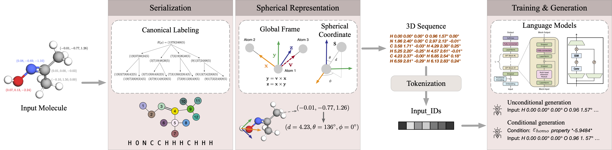

# Geometry Informed Tokenization of Molecules for Language Model Generation

This code accompanies the paper [Geometry Informed Tokenization of Molecules for Language Model Generation](https://arxiv.org/abs/2408.10120).
Our work applies LMs to the task of 3D molecule generation by translating the intricate geometry of molecules into a format that can be effectively processed by LMs. 
Our proposed tokenization method Geo2Seq is based on canonical labeling, which allows dimension reduction with no information loss outside graph isomorphism groups, and invariant spherical representations, which guarantees SE(3)-invariance under the equivariant global frame.
We harness the advanced sequence-processing capabilities and efficiency of LMs while retaining essential geometric and atomic information.



## Environment setup
Please refer to `enviroment.yml`.

### Mamba additional environment setup:

```bash
conda install -c "nvidia/label/cuda-11.8.0" cuda-toolkit

pip install causal-conv1d>=1.1.0

pip install mamba-ssm
```

### Optional ordering algorithm environment setup:
```bash
pip install numpy-hilbert-curve
```

## Data preparation & tokenization

We provide an example of the QM9 dataset to show the tokenization format, as `qm9_sph3_seq.txt` and `qm9_sph3_seq_val.txt` in the `data` folder.

The data preprocessing and tokenization can be done following `process_data_qm9.py` and `process_data_drug.py` for QM9 and GeomDrug datasets, respectively. 
The current `process_data_qm9.py` and `process_data_drug.py` show the simple example of SMILES order, while all other canonical/non-canonical orders can be used as well. We provide multiple ordering algorithm examples in `dataset_QM9_generation.py`. 

## Train example

Single-GPU:
```bash
CUDA_VISIBLE_DEVICES=0 python train.py --run_name unconditional_mamba_qm9 --batch_size 32 --num_props 0 --max_epochs 250 --model mamba --n_layer 24 --root_path qm9_sph3_seq --output_tokenizer_dir qm9_sph3_seq/tokenizer
```

Multi-GPU:
```bash
CUDA_VISIBLE_DEVICES=1,3,5,7 python train.py --run_name unconditional_mamba_drug --batch_size 32 --num_props 0 --max_epochs 45 --root_path XXXXX_seq --output_tokenizer_dir XXXXX/tokenizer --model mamba --n_layer 32 --max_len 750 --save_start_epoch 5 --save_interval_epoch 5 --dist
```

`--root_path XXXXX` is the path to the input data. `XXXXX.txt` should be a txt file containing the tokenized training data. `XXXXX_val.txt` should be a txt file containing the tokenized validation data.

`--output_tokenizer_dir` is the path to save the tokenizer model and vocab file. The script will save the tokenizer (vocab) file in this directory if it does not exist.

## Generation example

Model architecture parameters and `--root_path`, `--output_tokenizer_dir` should be the same as the training in order to load the checkpoint and tokenizer.
1. `run_name` is the name of the checkpoint's training run
2. `epoch` is the epoch of the checkpoint (stored at) to be loaded (such as the last epoch's stored ckpt) 
3. `top_k` is the number of top-k candidates to be sampled from, (suggest > 2% of the vocab size) 
4. `sample_repeats` is the total number of samples to be generated (suggest > 10000 for statistical significance)
5. `temperature`/`temp` is for the trade off between validity/diversity during generation

GPT/Mamba use different scripts.

GPT:
```bash
CUDA_VISIBLE_DEVICES=7 python train_3D/generate.py  --run_name unconditional_gpt_qm9 --batch_size 80 --num_props 0 --root_path XXXXX_seq --output_tokenizer_dir XXXXX/tokenizer --n_layer 12 --max_len 512 --epoch 200 --top_k 50 --temp 0.7 --sample_repeats 10000
```
Mamba:
```bash
CUDA_VISIBLE_DEVICES=6 python train_3D/generate_mamba.py --run_name unconditional_mamba_qm9 --batch_size 80 --num_props 0 --root_path XXXXX_seq --output_tokenizer_dir XXXXX/tokenizer --model mamba --n_layer 24 --max_len 512 --epoch 200 --topk 50 --temperature 0.7 --repeats 10000
```

## Evaluation example

Use the below command and replace the generated sample txt file for `--input_path`.

```bash
python eval_edm.py --dataset_name qm9 --rep_type spherical --input_path generated_samples_unconditional_qm9_ep200_top50_temp0.7.txt
```

## Reference

If you find this work useful in your research, please cite:

```bibtex
@article{li2024geometry,
  title={Geometry Informed Tokenization of Molecules for Language Model Generation},
  author={Li, Xiner and Wang, Limei and Luo, Youzhi and Edwards, Carl and Gui, Shurui and Lin, Yuchao and Ji, Heng and Ji, Shuiwang},
  journal={arXiv preprint arXiv:2408.10120},
  year={2024}
}
```  
