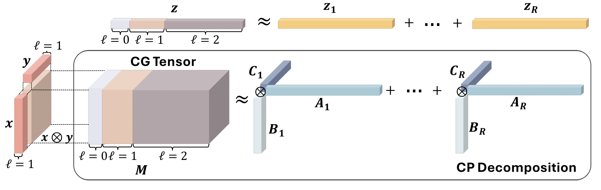

# TDN
Official code repository of paper “[Tensor Decomposition Networks for Fast Machine Learning Force Field Computations](https://arxiv.org/abs/2507.01131)” by Yuchao Lin, Cong Fu, Zachary Krueger, Haiyang Yu, Maho Nakata, Jianwen Xie, Emine Kucukbenli, Xiaofeng Qian, Shuiwang Ji. [[NeurIPS 2025 Poster](https://openreview.net/forum?id=9vKJyCUfMH)]



This repository contains code for **training, evaluation, and testing** on the **PubChemQCR** dataset. We’re tidying things up and will release the training scripts and model implementations soon.

## Environment Setup

See [ENVIRONMENT.md](ENVIRONMENT.md) for environment setup instructions.


## Dataset Preparation for PubChemQCR

PubChemQCR [1] provides relaxation trajectories for ~3.5M small molecules (PM3 → HF → DFT), totaling ~300M snapshots (≈105M at DFT). The dataset is available as a **subset** and a **full** split. For comprehensive details and benchmarks, please refer to the [preprint](https://arxiv.org/abs/2506.23008) and the [original repository](https://huggingface.co/datasets/divelab/PubChemQCR). **Before training, download the LMDB shards to your target directory.**

#### Important Flags

- `root`: path to the directory containing LMDB files
- `stage`: which optimization stage to load
  - `"pm3"` — PM3
  - `"hf"` — Hartree–Fock
  - `"1st"` — DFT first substage (Firefly/SMASH)
  - `"1st_smash"` — SMASH-only portion of the first DFT substage
  - `"2nd"` — DFT second substage (GAMESS)
  - `"mixing"` — DFT first **and** second substages
- `total_traj` (bool): load the full trajectory per molecule
- `SubsetOnly` (bool): load only the subset split

In this repository, all training uses **DFT first-stage** data with **full trajectories** (`stage="1st"`, `total_traj=True`).


## Training and Evaluation

We’re tidying things up and will release the training scripts and model implementations soon.


## Acknowledgement

The TDN architecture is partially based on [Equiformer](https://github.com/atomicarchitects/equiformer) [2].  This work is supported by ARPA-H under grant 1AY1AX000053, National Institutes of Health under grant U01AG070112, National Science Foundation under grant IIS-2243850, and the Air Force Office of Scientific Research (AFOSR) under Grant FA9550-24-1-0207. We acknowledge the support of Lambda, Inc. and NVIDIA for providing the computational resources for this project.


## Reference

[1] **A Benchmark for Quantum Chemistry Relaxations via Machine Learning Interatomic Potentials.** *Cong Fu, Yuchao Lin, Zachary Krueger, Wendi Yu, Xiaoning Qian, Byung-Jun Yoon, Raymundo Arróyave, Xiaofeng Qian, Toshiyuki Maeda, Maho Nakata, Shuiwang Ji.*

[2] **Equiformer: Equivariant Graph Attention Transformer for 3D Atomistic Graphs.** *Yi-Lun Liao, Tess Smidt.*


## Citation

```latex
@inproceedings{
    lin2025tensor,
    title={Tensor Decomposition Networks for Accelerating Machine Learning Force Field Computations},
    author={Yuchao Lin, Cong Fu, Zachary Krueger, Haiyang Yu, Maho Nakata, Jianwen Xie, Emine Kucukbenli, Xiaofeng Qian, Shuiwang Ji},
    booktitle={The Thirty-ninth Annual Conference on Neural Information Processing Systems},
    year={2025},
    url={https://openreview.net/forum?id=9vKJyCUfMH}
}
```
